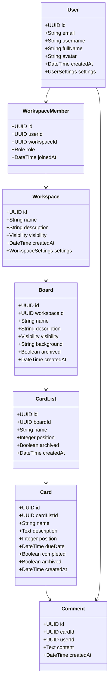
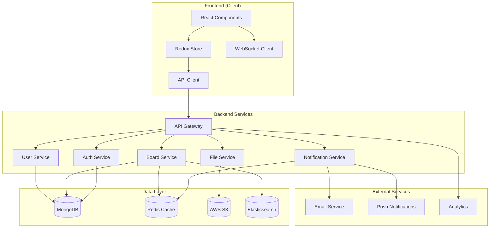
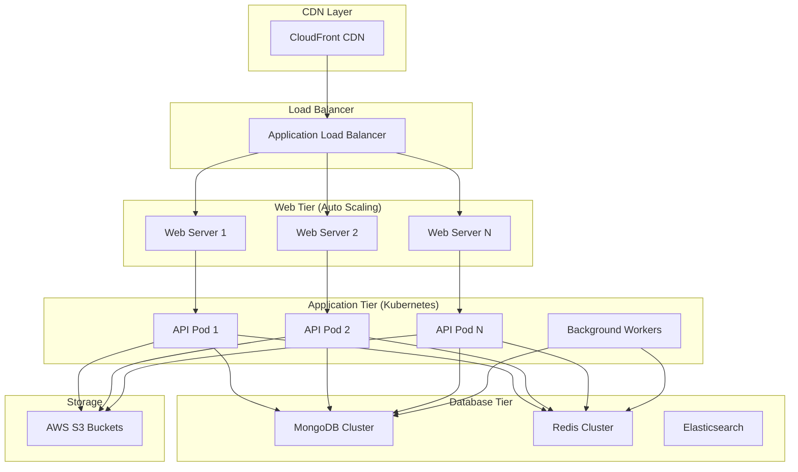

# Boardify - Visual Project Management System Documentation

**Group:** TAK24  
**Project:** Boardify - Visual Project Management System  
**Version:** 1.0  
**Date:** October 2025

---

## 1. Introduction

### 1.1 Project Purpose and Scope
Boardify is a visual project management system inspired by Trello, designed to help teams organize, track, and collaborate on projects using intuitive Kanban boards. The system provides a flexible, easy-to-use interface that adapts to various workflow types and team sizes.

**Key Goals:**
- Simplify project management through visual boards
- Enable seamless team collaboration 
- Support various workflow methodologies (Kanban, Agile, custom processes)
- Provide scalable solution from personal use to enterprise teams

**Project Scope:**
- Web-based application with responsive design
- Real-time collaboration features
- User management and permissions system
- Workflow automation capabilities
- Integration with external tools

### 1.2 Background and Current Situation
Traditional project management often relies on complex tools that overwhelm users or simple spreadsheets that lack collaboration features. There's a growing need for visual, intuitive tools that can:
- Bridge the gap between simplicity and functionality
- Support both technical and non-technical users
- Enable remote team collaboration
- Adapt to different industries and use cases

### 1.3 Stakeholders and Target Audience

**Primary Stakeholders:**
- **Development Teams** - Software developers using Agile methodologies
- **Project Managers** - Professionals coordinating team workflows
- **Creative Teams** - Designers, marketers managing campaigns
- **Small Business Owners** - Entrepreneurs organizing business processes
- **Remote Teams** - Distributed teams requiring collaboration tools

**Secondary Stakeholders:**
- **Enterprise Administrators** - IT managers requiring security and compliance
- **System Integrators** - Teams needing tool integrations
- **End Users** - Individual contributors and team members

---

## 2. Concepts and Terminology

### 2.1 Glossary

| Term | Definition |
|------|------------|
| **Board** | A project workspace containing lists and cards, representing a process or project |
| **List** | A vertical column on a board representing a stage in a workflow (e.g., "To Do", "In Progress", "Done") |
| **Card** | Individual task or item that moves through workflow stages |
| **Workspace** | Organizational unit grouping multiple boards and team members |
| **Power-Up** | Third-party integration or add-on extending board functionality |
| **Butler/Automation** | Built-in automation system for creating rules and commands |
| **Member** | User with access to specific boards or workspaces |
| **Observer** | User with read-only access to boards |
| **Kanban** | Visual workflow methodology using boards, lists, and cards |
| **Workflow** | Sequence of stages that tasks move through from start to completion |

### 2.2 Abbreviations
- **UI/UX** - User Interface/User Experience
- **API** - Application Programming Interface
- **REST** - Representational State Transfer
- **CRUD** - Create, Read, Update, Delete
- **SaaS** - Software as a Service
- **SSO** - Single Sign-On
- **RBAC** - Role-Based Access Control

### 2.3 Standards
- **Web Standards:** HTML5, CSS3, JavaScript ES6+
- **API Standards:** RESTful API design, JSON data format
- **Security Standards:** HTTPS, OAuth 2.0, JWT tokens
- **Accessibility:** WCAG 2.1 compliance

---

## 3. Business Requirements and Context

### 3.1 Problem Description
Modern teams struggle with:
- **Information Silos:** Work scattered across emails, documents, and tools
- **Lack of Visibility:** Difficulty tracking project progress and bottlenecks
- **Complex Tools:** Existing solutions too complicated for simple workflows
- **Poor Collaboration:** Limited real-time collaboration capabilities
- **Inflexible Processes:** Tools that don't adapt to team-specific workflows

### 3.2 Business Processes and Workflows

**Core Business Processes:**

1. **Project Creation Workflow**
   - User creates new board
   - Sets up lists representing workflow stages
   - Invites team members
   - Configures permissions and settings

2. **Task Management Workflow**
   - Create cards for tasks/items
   - Add details, due dates, checklists
   - Assign members
   - Move cards through workflow stages
   - Track progress and completion

3. **Collaboration Workflow**
   - Comment on cards
   - Mention team members (@mentions)
   - Share attachments and files
   - Receive notifications for updates

4. **Process Automation Workflow**
   - Set up automation rules
   - Trigger actions based on events
   - Schedule recurring tasks
   - Integrate with external systems

### 3.3 User and Client Needs

**By User Type:**

**Individual Users:**
- Personal task organization
- Simple workflow management
- Calendar integration
- Mobile accessibility

**Small Teams (2-10 people):**
- Team collaboration
- Shared project visibility
- Basic permission controls
- Template libraries

**Medium Teams (10-100 people):**
- Advanced permissions
- Multiple project management
- Reporting and analytics
- Power-Ups and integrations

**Enterprise Teams (100+ people):**
- Enterprise security features
- Admin controls and governance
- Advanced analytics
- Custom branding

### 3.4 Competitive Analysis

**Direct Competitors:**
- **Trello** - Market leader in visual project management
- **Asana** - Feature-rich project management with multiple views
- **Monday.com** - Colorful, customizable work management platform

**Competitive Advantages:**
- Simplified user experience
- Superior automation capabilities
- Better mobile experience
- More affordable pricing for small teams
- Enhanced real-time collaboration

---

## 4. Functional Requirements

### 4.1 User Stories and Scenarios

**Epic 1: Board Management**

*User Story 1.1:* As a project manager, I want to create and customize boards so that I can organize different projects visually.

*Acceptance Criteria:*
- Create new boards with custom names and descriptions
- Choose from board templates or start blank
- Set board visibility (private, workspace, public)
- Customize board backgrounds and themes

*User Story 1.2:* As a team member, I want to view all boards I have access to so that I can quickly navigate between projects.

**Epic 2: Task Management**

*User Story 2.1:* As a team member, I want to create and manage cards so that I can track individual tasks and their details.

*Acceptance Criteria:*
- Create cards with titles and descriptions
- Add due dates, checklists, and labels
- Attach files and links
- Set card priorities

*User Story 2.2:* As a user, I want to move cards between lists so that I can track task progress through workflow stages.

**Epic 3: Team Collaboration**

*User Story 3.1:* As a team member, I want to comment on cards and mention colleagues so that I can communicate about specific tasks.

*Acceptance Criteria:*
- Add comments with rich text formatting
- Mention team members using @username
- Receive notifications for mentions
- View comment history and timestamps

*User Story 3.2:* As a project manager, I want to assign team members to cards so that responsibility is clear and notifications are sent.

*Acceptance Criteria:*
- Assign multiple members to cards
- See assigned members on card faces
- Automatic notifications to assigned members
- Filter cards by assigned member

**Epic 4: Workflow Management**

*User Story 4.1:* As a team lead, I want to create custom workflows so that I can match our team's specific processes.

*Acceptance Criteria:*
- Create custom list sequences
- Set up workflow templates
- Configure automation rules
- Track workflow completion metrics

*User Story 4.2:* As a user, I want to set due dates and priorities so that I can manage time-sensitive tasks effectively.

*Acceptance Criteria:*
- Set due dates with calendar picker
- Add priority labels (high, medium, low)
- Receive due date notifications
- Sort cards by due date or priority

**Epic 5: Reporting and Analytics**

*User Story 5.1:* As a project manager, I want to view project progress reports so that I can track team performance and identify bottlenecks.

*Acceptance Criteria:*
- Generate burndown charts
- View completion statistics
- Export progress reports
- Set up automated status updates

**Usage Scenarios:**

**Scenario 1: Software Development Team**
- Team creates "Sprint Planning" board
- Lists: Backlog → In Progress → Code Review → Testing → Done
- Daily standup using board overview
- Sprint retrospective using completed cards data

**Scenario 2: Marketing Campaign Management** 
- Create "Product Launch Campaign" board
- Lists: Ideas → Research → Content Creation → Review → Published
- Assign content pieces to team members
- Track campaign timeline with due dates

**Scenario 3: Event Planning**
- Board: "Annual Conference 2025"
- Lists: Planning → Vendor Contact → Confirmed → In Progress → Completed
- Attach vendor contracts and documents
- Coordinate multiple teams (catering, venue, speakers)

### 4.2 System Functionality

**Core Features:**

1. **Board Management**
   - Create, edit, delete boards
   - Board templates and duplication
   - Board settings and customization
   - Archive and restore functionality

2. **List Management**
   - Create, reorder, and manage lists
   - List limits and automation
   - Archive completed lists

3. **Card Management**
   - Full CRUD operations for cards
   - Card details: descriptions, checklists, due dates
   - File attachments and link previews
   - Card dependencies and relationships

4. **User Management**
   - User registration and authentication
   - Profile management
   - Team and workspace management

5. **Collaboration Features**
   - Real-time comments and mentions
   - Activity feeds and notifications
   - Sharing and permission management

6. **Automation System**
   - Butler automation rules
   - Scheduled commands
   - Integration webhooks

### 4.3 User Roles and Permissions

**Role Hierarchy:**

1. **System Administrator**
   - Full system access
   - User management
   - System configuration
   - Security settings

2. **Workspace Administrator**
   - Manage workspace settings
   - Add/remove members
   - Board creation permissions
   - Power-Up management

3. **Board Administrator**
   - Full board access
   - Member management
   - Board settings
   - Archive/delete permissions

4. **Board Member**
   - Create and edit cards
   - Comment and collaborate
   - Move cards between lists
   - View all board content

5. **Observer**
   - Read-only access
   - View cards and comments
   - Cannot edit content
   - Can comment (if enabled)

**Permission Matrix:**

| Action | System Admin | Workspace Admin | Board Admin | Member | Observer |
|--------|--------------|-----------------|-------------|---------|----------|
| Create Boards | ✓ | ✓ | ✓ | ✓* | ✗ |
| Edit Board Settings | ✓ | ✓ | ✓ | ✗ | ✗ |
| Add/Remove Members | ✓ | ✓ | ✓ | ✗ | ✗ |
| Create/Edit Cards | ✓ | ✓ | ✓ | ✓ | ✗ |
| Comment on Cards | ✓ | ✓ | ✓ | ✓ | ✓* |
| View Board Content | ✓ | ✓ | ✓ | ✓ | ✓ |

*depending on settings

---

## 5. Non-Functional Requirements

### 5.1 Performance and Scalability
- **Response Time:** < 200ms for standard operations
- **Page Load Time:** < 3 seconds for initial load
- **Concurrent Users:** Support 10,000+ simultaneous users
- **Database Performance:** < 100ms for 95% of queries
- **Real-time Updates:** < 1 second latency for collaboration features

### 5.2 Availability and Reliability
- **Uptime:** 99.9% availability (SLA target)
- **Recovery Time:** < 1 hour for critical failures
- **Data Backup:** Automated daily backups with 30-day retention
- **Redundancy:** Multi-region deployment for disaster recovery

### 5.3 Security
- **Authentication:** Multi-factor authentication support
- **Authorization:** Role-based access control (RBAC)
- **Data Encryption:** TLS 1.3 for data in transit, AES-256 for data at rest
- **Privacy:** GDPR and SOC 2 compliance
- **Audit Logging:** Complete audit trail for all user actions

### 5.4 Usability
- **Learning Curve:** New users productive within 15 minutes
- **Accessibility:** WCAG 2.1 AA compliance
- **Mobile Support:** Responsive design for tablets and smartphones
- **Browser Support:** Modern browsers (Chrome, Firefox, Safari, Edge)
- **Offline Capability:** Basic functionality when offline

### 5.5 Compatibility and Integrations
- **API Compatibility:** RESTful API with webhook support
- **Third-party Integrations:** 50+ popular tools (Slack, Google Drive, etc.)
- **Import/Export:** Support for CSV, JSON data formats
- **Email Integration:** Create cards via email
- **Calendar Sync:** Two-way calendar synchronization

---

## 6. Data Model

### 6.1 Core Data Entities

**User Entity:**
```
User {
  id: UUID
  email: String (unique)
  username: String (unique)
  fullName: String
  avatar: String (URL)
  createdAt: DateTime
  lastActive: DateTime
  settings: UserSettings
}
```

**Workspace Entity:**
```
Workspace {
  id: UUID
  name: String
  description: String
  visibility: Enum (private, public)
  createdAt: DateTime
  settings: WorkspaceSettings
}
```

**Board Entity:**
```
Board {
  id: UUID
  workspaceId: UUID (FK)
  name: String
  description: String
  visibility: Enum (private, workspace, public)
  background: String
  createdAt: DateTime
  archived: Boolean
  settings: BoardSettings
}
```

**List Entity:**
```
List {
  id: UUID
  boardId: UUID (FK)
  name: String
  position: Integer
  archived: Boolean
  createdAt: DateTime
}
```

**Card Entity:**
```
Card {
  id: UUID
  listId: UUID (FK)
  name: String
  description: Text
  position: Integer
  dueDate: DateTime
  completed: Boolean
  archived: Boolean
  createdAt: DateTime
  updatedAt: DateTime
}
```

### 6.2 Class Diagrams



### 6.3 Entity Relationships

**Many-to-Many Relationships:**
- Users ↔ Workspaces (through WorkspaceMember)
- Users ↔ Boards (through BoardMember)
- Users ↔ Cards (through CardMember - assignments)

**One-to-Many Relationships:**
- Workspace → Boards
- Board → Lists
- List → Cards
- Card → Comments
- Card → Attachments
- User → Comments

**Key Constraints:**
- Email addresses must be unique across users
- Card positions must be unique within lists
- List positions must be unique within boards
- Workspace names must be unique per user

---

## 7. System Architecture

### 7.1 Architectural Principles and Choices

**Design Principles:**
- **Modularity:** Component-based architecture for maintainability
- **Scalability:** Horizontal scaling capabilities
- **Performance:** Optimized for real-time collaboration
- **Security:** Security-first design approach
- **Flexibility:** Plugin architecture for extensibility

**Architectural Style:** Single Page Application (SPA) with microservices backend

### 7.2 Technology Stack and Frameworks

**Frontend Technologies:**
- **Framework:** React.js 18+ with TypeScript
- **State Management:** Redux Toolkit with RTK Query
- **UI Components:** Custom component library with Styled Components
- **Build Tool:** Vite for fast development and building
- **Testing:** Jest + React Testing Library

**Backend Technologies:**
- **Runtime:** Node.js with Express.js framework
- **Language:** TypeScript for type safety
- **API Style:** RESTful APIs with GraphQL for complex queries
- **Authentication:** JWT tokens with refresh token rotation
- **File Storage:** AWS S3 for attachments and media

**Database:**
- **Primary Database:** MongoDB for document storage
- **Caching:** Redis for session management and real-time features
- **Search:** Elasticsearch for full-text search capabilities

**Infrastructure:**
- **Cloud Provider:** AWS (Amazon Web Services)
- **Container Orchestration:** Docker + Kubernetes
- **Load Balancer:** AWS Application Load Balancer
- **CDN:** CloudFront for static asset delivery

### 7.3 Logical Architecture (Components and Relationships)



**Component Responsibilities:**

**Frontend Components:**
- **UI Components:** Reusable React components for boards, cards, lists
- **State Management:** Centralized application state with Redux
- **API Client:** HTTP client for backend communication
- **WebSocket Client:** Real-time updates and collaboration

**Backend Services:**
- **API Gateway:** Request routing, rate limiting, authentication
- **Auth Service:** User authentication and authorization
- **Board Service:** Board, list, and card management
- **User Service:** User profile and workspace management
- **Notification Service:** Real-time notifications and email alerts
- **File Service:** File upload, storage, and retrieval

### 7.4 Physical Architecture / Deployment View

**Production Environment:**



**Deployment Specifications:**
- **Web Servers:** 3+ instances, auto-scaling based on CPU/memory
- **API Services:** Kubernetes pods with horizontal pod autoscaling
- **Database:** MongoDB replica set with 3 nodes
- **Cache:** Redis cluster with 3 master nodes
- **File Storage:** S3 with multi-region replication

---

## 8. User Interface and Prototypes

### 8.1 Key Screen Mockups and Prototypes

**Wireframe 1: Main Dashboard**
┌────────────────────────────────────────────────────────────────┐
│ Boardify                    🔍 Search    👤 Profile   ⚙️        │
├──────────┬─────────────────────────────────────────────────────┤
│          │  My Boards                              + New Board  │
│          │                                                      │
│  📋      │  ┌─────────┐  ┌─────────┐  ┌─────────┐            │
│  Work    │  │ Sprint  │  │Marketing│  │ Design  │            │
│  📁      │  │ Board   │  │Campaign │  │ Tasks   │            │
│  Personal│  │ ⭐      │  │         │  │         │            │
│  ⭐      │  │ 12 cards│  │ 8 cards │  │ 5 cards │            │
│  Starred │  └─────────┘  └─────────┘  └─────────┘            │
│          │                                                      │
│  Recent  │  Recent Boards:                                     │
│  ───     │  • Project Alpha (Updated 2h ago)                   │
│          │  • Q4 Planning (Updated yesterday)                  │
└──────────┴─────────────────────────────────────────────────────┘

**Wireframe 2: Board View (Kanban Layout)**
┌────────────────────────────────────────────────────────────────┐
│ ← Boards   Sprint Planning Board    ⭐ 👥 Share  ⚙️ Menu      │
├────────────────────────────────────────────────────────────────┤
│                                                                 │
│  ┌─────────┐  ┌─────────┐  ┌─────────┐  ┌─────────┐ + Add    │
│  │ To Do   │  │In Progress│ │ Review  │  │  Done   │   List   │
│  │ ─────   │  │ ───────── │ │ ─────── │  │ ─────── │          │
│  │         │  │           │ │         │  │         │          │
│  │┌───────┐│  │┌───────┐ │ │┌───────┐│  │┌───────┐│          │
│  ││Login  ││  ││API     │ │ ││Testing││  ││Deploy ││          │
│  ││screen ││  ││integr. │ │ ││       ││  ││       ││          │
│  ││📅 Oct5││  ││👤 John │ │ ││👤 Mary││  ││✅     ││          │
│  │└───────┘│  │└───────┘ │ │└───────┘│  │└───────┘│          │
│  │         │  │           │ │         │  │         │          │
│  │┌───────┐│  │┌───────┐ │ │         │  │┌───────┐│          │
│  ││Dashboard││ ││Database│ │ │         │  ││Setup  ││          │
│  ││design ││  ││update  │ │ │         │  ││CI/CD  ││          │
│  ││👤 Alex││  ││👤 Sam  │ │ │         │  ││✅     ││          │
│  │└───────┘│  │└───────┘ │ │         │  │└───────┘│          │
│  │         │  │           │ │         │  │         │          │
│  │+ Add    │  │+ Add     │ │+ Add    │  │+ Add    │          │
│  └─────────┘  └─────────┘  └─────────┘  └─────────┘          │
└────────────────────────────────────────────────────────────────┘

**Wireframe 3: Card Detail Modal**
┌────────────────────────────────────────────────────────────────┐
│ ✕ API Integration Task                                         │
├────────────────────────────────────────────────────────────────┤
│                                                                 │
│ In list: "In Progress"                                   📋 Move│
│                                                                 │
│ 👥 Members: [👤 John] [+]                                      │
│                                                                 │
│ 🏷️ Labels: [Backend][High Priority]                           │
│                                                                 │
│ 📝 Description:                                                │
│ ┌──────────────────────────────────────────────────────────┐  │
│ │ Integrate payment gateway API                            │  │
│ │ - Setup authentication                                   │  │
│ │ - Test endpoints                                         │  │
│ └──────────────────────────────────────────────────────────┘  │
│                                                                 │
│ ✓ Checklist (2/4):                                             │
│   ☑ Research API documentation                                 │
│   ☑ Create test account                                        │
│   ☐ Implement endpoints                                        │
│   ☐ Write unit tests                                           │
│                                                                 │
│ 📅 Due Date: Oct 10, 2025    ⏰ Reminder: 1 day before         │
│                                                                 │
│ 📎 Attachments:                                                │
│   [📄 api-specs.pdf]  [🔗 Documentation link]                 │
│                                                                 │
│ 💬 Activity:                                                   │
│ ┌──────────────────────────────────────────────────────────┐  │
│ │ 👤 John: Updated checklist - 2 hours ago                 │  │
│ │ 👤 Mary: @John please review when ready - 1 day ago      │  │
│ │ [Write a comment...]                              [Send] │  │
│ └──────────────────────────────────────────────────────────┘  │
│                                                                 │
│ [Archive] [Delete]                                    [Save]   │
└────────────────────────────────────────────────────────────────┘

**Wireframe 4: Mobile View**
Mobile Phone View (375px width):
┌─────────────────┐
│ ☰  Boardify  🔔 │
├─────────────────┤
│                 │
│ Sprint Board    │
│ ═══════════════ │
│                 │
│ To Do        ▼  │
│ ┌─────────────┐ │
│ │Login screen │ │
│ │👤 Alex      │ │
│ │📅 Oct 5     │ │
│ └─────────────┘ │
│ ┌─────────────┐ │
│ │Dashboard    │ │
│ │design       │ │
│ └─────────────┘ │
│                 │
│ In Progress  ▼  │
│ ┌─────────────┐ │
│ │API integr.  │ │
│ │👤 John      │ │
│ └─────────────┘ │
│                 │
│ [+] Add Card    │
│                 │
├─────────────────┤
│🏠 📋 👤 ⚙️     │
└─────────────────┘

**Interactive Prototype Features:**
- Drag-and-drop cards between lists (visual feedback with ghost card)
- Click card to open detail modal with smooth animation
- Hover states showing interactive elements
- Real-time updates with subtle pulse animation
- Collapsible sidebar on smaller screens


### 8.2 User Experience Principles

**Design Philosophy:**
- **Simplicity:** Clean, uncluttered interface focusing on content
- **Visual Hierarchy:** Clear information architecture and visual flow
- **Immediate Feedback:** Real-time updates and visual feedback for actions
- **Consistency:** Consistent design patterns across all interfaces
- **Accessibility:** Inclusive design for users with disabilities

**Key UX Features:**
- **Drag-and-Drop:** Intuitive card and list manipulation
- **Keyboard Shortcuts:** Power user efficiency features
- **Smart Defaults:** Intelligent default settings for new users
- **Progressive Disclosure:** Advanced features revealed as needed
- **Contextual Help:** In-app guidance and tooltips

**Interaction Patterns:**
- Click to edit text in place
- Hover states for interactive elements
- Smooth animations for state transitions
- Modal dialogs for detailed editing
- Sidebar panels for settings and information

---

## 9. Risk Analysis

### 9.1 Primary Risks (Technical, Security, Business, Project)

**Technical Risks:**

*Risk T1: Real-time Synchronization Conflicts*
- **Probability:** Medium
- **Impact:** High
- **Description:** Concurrent editing conflicts when multiple users modify the same card
- **Mitigation:** Implement operational transformation or conflict resolution algorithms

*Risk T2: Database Performance Degradation*
- **Probability:** Medium
- **Impact:** High
- **Description:** MongoDB performance issues with large datasets
- **Mitigation:** Implement database sharding, indexing optimization, and query performance monitoring

*Risk T3: Third-party Integration Failures*
- **Probability:** High
- **Impact:** Medium
- **Description:** External API changes breaking integrations
- **Mitigation:** Implement robust error handling, API versioning, and fallback mechanisms

**Security Risks:**

*Risk S1: Data Breach via API Vulnerabilities*
- **Probability:** Low
- **Impact:** Critical
- **Description:** Unauthorized access to user data through API exploitation
- **Mitigation:** Regular security audits, input validation, rate limiting, and penetration testing

*Risk S2: Account Takeover Attacks*
- **Probability:** Medium
- **Impact:** High
- **Description:** Compromised user accounts through weak authentication
- **Mitigation:** Mandatory 2FA for enterprise accounts, account lockout policies, and suspicious activity monitoring

**Business Risks:**

*Risk B1: Market Competition*
- **Probability:** High
- **Impact:** Medium
- **Description:** Established competitors (Trello, Asana) limiting market share
- **Mitigation:** Focus on unique value propositions, superior user experience, and competitive pricing

*Risk B2: User Adoption Challenges*
- **Probability:** Medium
- **Impact:** High
- **Description:** Low user engagement and retention rates
- **Mitigation:** Comprehensive onboarding, user feedback loops, and feature education

**Project Risks:**

*Risk P1: Development Timeline Overruns*
- **Probability:** High
- **Impact:** Medium
- **Description:** Complex features taking longer than estimated
- **Mitigation:** Agile development methodology, regular sprint reviews, and scope prioritization

*Risk P2: Key Personnel Departure*
- **Probability:** Low
- **Impact:** High
- **Description:** Loss of critical team members affecting project continuity
- **Mitigation:** Knowledge documentation, cross-training, and succession planning

### 9.2 Risk Mitigation Strategies

**Technical Mitigation Strategies:**
1. **Performance Monitoring:** Implement comprehensive application and infrastructure monitoring
2. **Automated Testing:** Extensive test coverage including unit, integration, and end-to-end tests
3. **Graceful Degradation:** Design system to function with reduced capability during failures
4. **Regular Backups:** Automated backup procedures with tested restoration processes

**Security Mitigation Strategies:**
1. **Security-First Development:** Secure coding practices and regular security training
2. **Regular Audits:** Quarterly security assessments and vulnerability scans
3. **Incident Response Plan:** Documented procedures for security incident handling
4. **Compliance Monitoring:** Regular compliance checks for GDPR, SOC 2, and other standards

**Business Mitigation Strategies:**
1. **Market Research:** Continuous competitive analysis and user research
2. **Feature Differentiation:** Focus on unique features and superior user experience
3. **Customer Success:** Dedicated customer success team for user retention
4. **Pricing Strategy:** Flexible pricing tiers to compete effectively

**Project Mitigation Strategies:**
1. **Agile Methodology:** Iterative development with regular stakeholder feedback
2. **Resource Planning:** Contingency planning for team scaling and skill gaps
3. **Scope Management:** Clear requirements definition and change control processes
4. **Quality Assurance:** Dedicated QA processes and user acceptance testing

---

## 10. Additional Documentation

### 10.1 Constraints and Assumptions

**Technical Constraints:**
- Must support modern web browsers (last 2 versions)
- MongoDB document size limit (16MB per document)
- Real-time features require WebSocket support
- Mobile app development not included in initial scope

**Business Constraints:**
- Limited initial budget for third-party services
- Must launch MVP within 6 months
- Compliance with GDPR and data protection regulations
- Integration requirements with existing enterprise tools

**Assumptions:**
- Users have reliable internet connectivity for real-time features
- Target audience is comfortable with web-based applications
- Email infrastructure available for notifications
- Cloud hosting costs remain within projected budget

### 10.2 Integration with Other Systems

**Email Systems:**
- SMTP integration for notification delivery
- Email-to-board functionality for card creation
- Calendar invitations for due dates

**Authentication Providers:**
- Google OAuth 2.0 integration
- Microsoft Azure AD for enterprise SSO
- SAML 2.0 support for enterprise identity providers

**File Storage Systems:**
- Google Drive file attachment integration
- Dropbox file synchronization
- OneDrive for business integration

**Communication Tools:**
- Slack integration for notifications and card creation
- Microsoft Teams webhook integration
- Discord bot for team notifications

**Development Tools:**
- GitHub integration for code repository linking
- GitLab CI/CD pipeline integration
- Jira import/export for migration support

### 10.3 Future Plans and Extension Possibilities

**Phase 2 Enhancements (6-12 months):**
- Advanced reporting and analytics dashboard
- Time tracking capabilities
- Gantt chart view for project timelines
- Custom field types and form builder
- API rate limiting and enterprise API features

**Phase 3 Expansions (12-24 months):**
- Native mobile applications (iOS/Android)
- Offline synchronization capabilities
- Advanced automation with conditional logic
- White-label solution for enterprise customers
- AI-powered task suggestions and insights

**Long-term Vision (2+ years):**
- Machine learning for predictive project analytics
- Advanced workflow designer with visual programming
- Marketplace for third-party power-ups and extensions
- Enterprise portfolio management features
- Global deployment with region-specific data residency

**Potential Integrations:**
- CRM systems (Salesforce, HubSpot)
- Accounting software (QuickBooks, Xero)
- HR systems (BambooHR, Workday)
- Business intelligence tools (Tableau, Power BI)
- Customer support platforms (Zendesk, Intercom)

---

## Conclusion

This documentation provides a comprehensive foundation for developing a modern visual project management system. The architecture balances simplicity with scalability, ensuring the system can grow from individual use to enterprise deployment while maintaining excellent user experience and performance.

The modular design and clear separation of concerns will enable efficient development and future enhancements. Regular review and updates of this documentation will ensure it remains current with project evolution and changing requirements.

**Next Steps:**
1. Technical specification development
2. UI/UX design prototype creation
3. Development environment setup
4. Sprint planning and backlog creation
5. Initial MVP development phase

---

*This document serves as the primary reference for the Boardify project development and should be updated as requirements evolve and the system develops.*